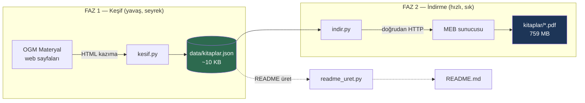
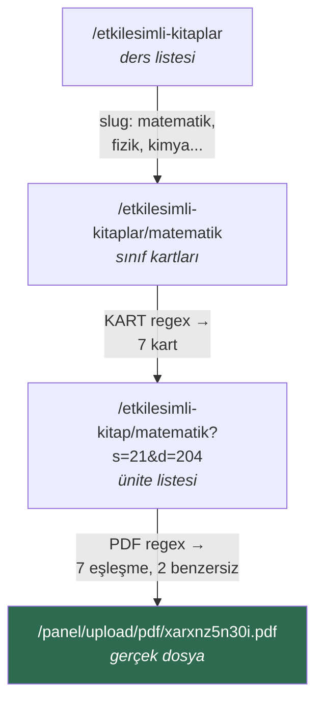
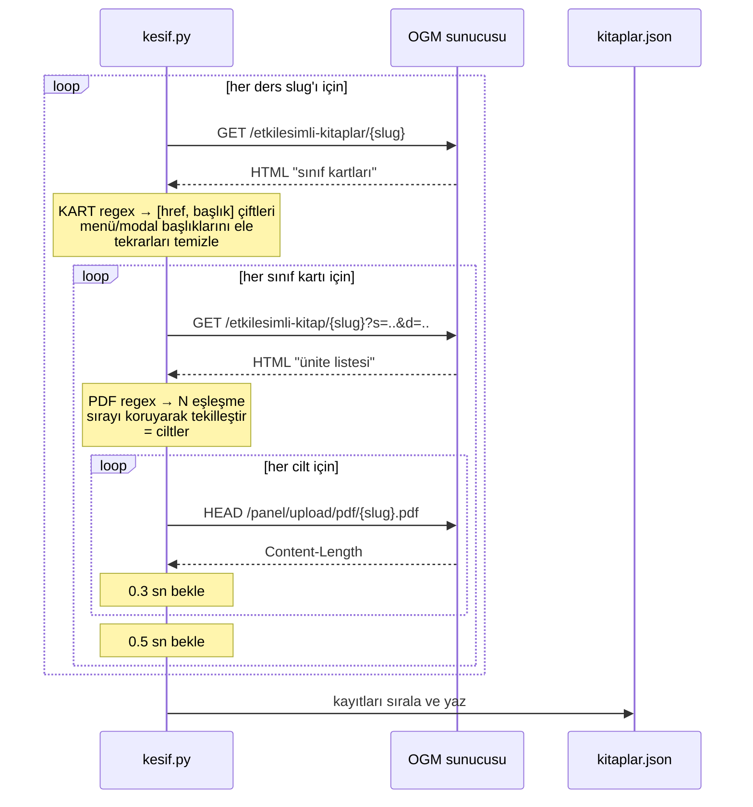
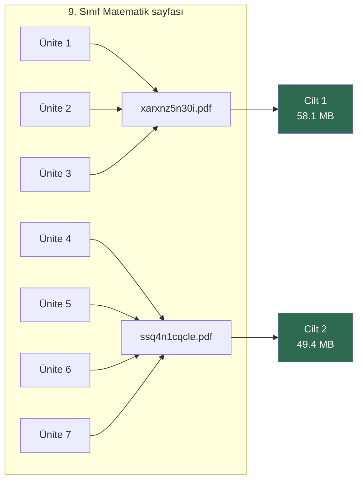
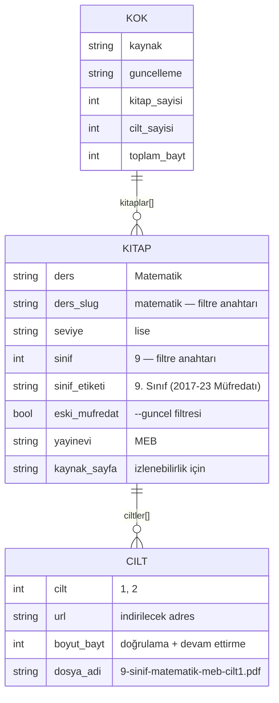
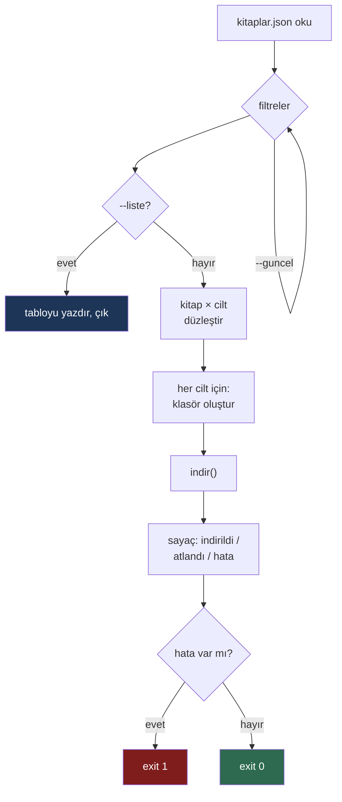
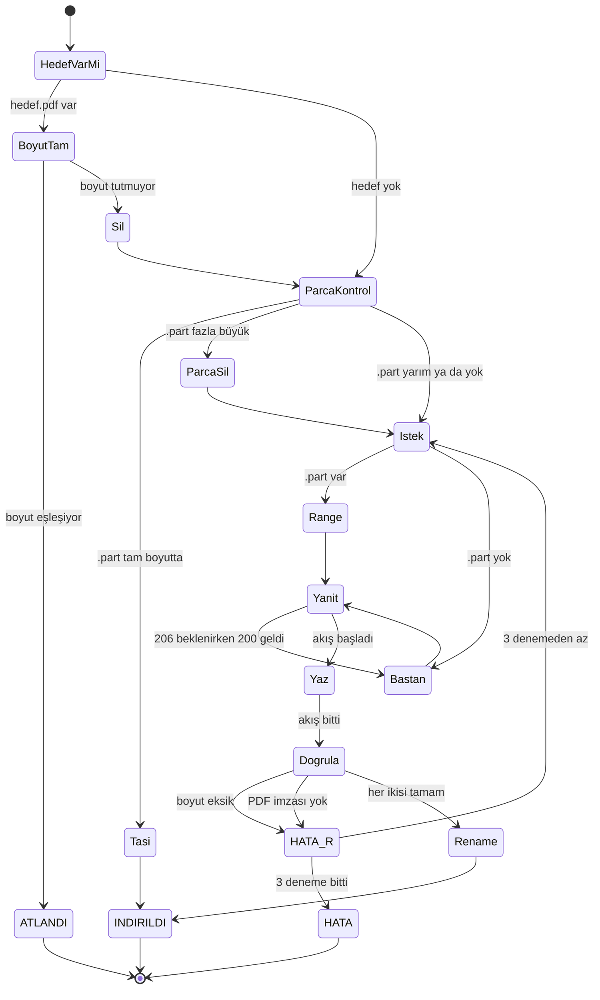
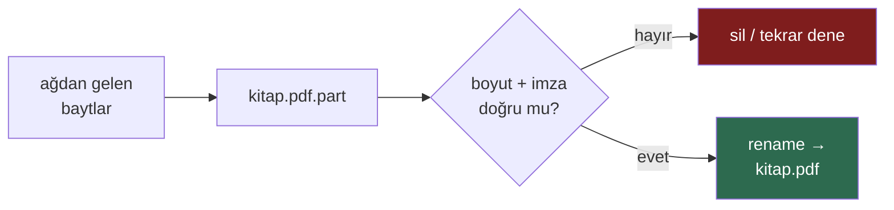

# Mimari — Repo Nasıl Çalışır?

Bu belge deponun iç işleyişini anlatır. Kullanım için [README.md](README.md)'ye bak.

---

## 1. Temel fikir: iki fazlı tasarım

Projenin tek önemli mimari kararı şu: **metadata toplamak** ile **bayt indirmek**
birbirinden ayrıldı.



**Neden ayrı?** Üç sebep:

| Sebep | Açıklama |
|---|---|
| **Hız** | Keşif ~40 saniye sürüyor (30+ HTTP isteği). Kullanıcı her indirmede bunu beklemek zorunda değil. |
| **Kırılganlık izolasyonu** | MEB HTML'i değiştirirse sadece `kesif.py` bozulur. `indir.py` JSON'a bakar, HTML'e değil. |
| **Denetlenebilirlik** | `kitaplar.json` git'te versiyonlanıyor. MEB bir kitabı sessizce değiştirdiğinde diff'te görünür. |

Bu ayrım aynı zamanda deponun **hiç PDF barındırmamasını** mümkün kılıyor:
repoda sadece 10 KB'lık bir işaretçi dosyası var, baytlar kullanıcının
makinesine MEB'den doğrudan iniyor.

---

## 2. Faz 1 — `scraper/kesif.py`

### Kazıma zinciri

OGM Materyal'de bir PDF'e ulaşmak için üç seviye inmek gerekiyor:



Kod sadece **L2'den** başlıyor — ders slug'ları `VARSAYILAN_DERSLER` sözlüğünde
elle tutuluyor. Sebep: L1'i kazımak 60+ dersin hepsini getirirdi, oysa kapsamı
bilinçli olarak dar tutuyoruz.

### Adım adım işleyiş



Aradaki `sleep`'ler bilinçli: MEB sunucusuna saniyede onlarca istek atmıyoruz.
Toplam ~30 istek, ~40 saniye.

### İki kritik regex

**`KART`** — sınıf kartını başlığıyla eşleştirir:

```python
r'href="(/etkilesimli-kitap/[^"]*?\?s=\d+[^"]*)".*?<h4>(.*?)</h4>'
```

HTML'de `<a href="...">` ile `<h4>9. Sınıf</h4>` arasında birkaç `div` var.
`.*?` (tembel eşleşme) + `re.DOTALL` ile aradaki her şeyi atlıyoruz. Tembel
olması şart — açgözlü olsaydı ilk href'i **son** h4 ile eşleştirirdi.

Bu regex menüdeki `<h5>Menü</h5>` gibi alakasız başlıkları da yakalayabilir,
o yüzden arkasından bir filtre var: başlık ya `N.` ile başlamalı ya da
"Hazırlık" içermeli.

**`PDF`** — dosya bağlantısını çeker:

```python
r'href="(https://ogmmateryal\.eba\.gov\.tr/panel/upload/pdf/[a-z0-9]+\.pdf)"'
```

Slug'lar (`xarxnz5n30i`) rastgele — tahmin edilemez, üretilemez. Kazımak tek yol.

### Cilt tespiti: en can alıcı nokta

Sayfa kitabı **ünite ünite** listeliyor, ama her ünitenin yanına o ünitenin ait
olduğu **cildin tamamını** koyuyor:



Yani 7 link → 2 dosya. Kod **sırayı koruyarak tekilleştiriyor**:

```python
ciltler, gorulen_pdf = [], set()
for pdf_url in PDF.findall(kitap_sayfasi):
    if pdf_url not in gorulen_pdf:
        gorulen_pdf.add(pdf_url)
        ciltler.append(pdf_url)
```

`set()` tek başına kullanılsaydı sıra kaybolur, cilt 1 ile cilt 2 rastgele
yer değiştirirdi. Liste + set kombinasyonu hem tekilliği hem sırayı korur —
sayfadaki ilk görünme sırası = cilt sırası.

### Veri modeli



`boyut_bayt` sadece bilgi değil — indiricinin **doğrulama ve devam ettirme**
mekanizması buna dayanıyor.

`dosya_adi` keşif anında üretiliyor, indirme anında değil. Böylece dosya adı da
versiyonlanmış veri oluyor: adlandırma mantığı değişirse diff'te görünür.

---

## 3. Faz 2 — `indir.py`

### Genel akış



`exit 1` bilinçli: bu betiği bir cron/CI içinde çalıştırırsan başarısızlığı
otomatik yakalayabilirsin.

### `indir()` — durum makinesi

Fonksiyonun asıl karmaşıklığı burada. Her cilt için:



Bu makinenin çözdüğü gerçek problemler:

| Durum | Ne olur |
|---|---|
| Aynı komut ikinci kez çalıştırıldı | Boyut eşleşir → `ATLANDI`. İdempotent. |
| İndirme %60'ta kesildi | `.part` kalır, sonraki çalıştırma `Range: bytes=X-` ile kaldığı yerden devam eder. |
| Sunucu `Range`'i yok saydı | Yanıt 206 yerine 200 gelir → kod fark eder, `.part`'ı silip baştan başlar. |
| MEB hata sayfası döndü | `%PDF-` imzası tutmaz → dosya silinir, tekrar denenir. |
| MEB kitabı güncelledi (boyut değişti) | Mevcut dosya boyutu tutmaz → silinir, yenisi iner. |
| Ağ koptu | 3 deneme, artan bekleme (2s, 4s). |

### Atomik yazma

Kritik ayrıntı: indirme **hiçbir zaman** doğrudan hedef dosyaya yazmaz.



`rename` işletim sistemi düzeyinde atomiktir. Sonuç: `kitap.pdf` adlı bir dosya
diskte varsa, **kesinlikle** eksiksiz ve doğrulanmıştır. Yarım PDF diye bir şey
oluşamaz. `.part` uzantısı da `.gitignore`'da — kaza eseri commit edilemez.

### Doğrulama neden iki katmanlı?

```python
if gecici.stat().st_size != beklenen_boyut:   # 1. katman
    raise OSError("eksik indirme")
if f.read(5) != b"%PDF-":                      # 2. katman
    raise OSError("gelen dosya PDF degil")
```

Boyut kontrolü **eksik** indirmeyi yakalar. İmza kontrolü **yanlış içeriği**
yakalar — MEB bir gün 34 MB'lık bir HTML hata sayfası döndürürse boyut kontrolü
bunu geçirebilir, imza kontrolü geçirmez.

### Çıktı klasör düzeni

```
kitaplar/
└── lise/                        ← k["seviye"]
    ├── 9-sinif/                 ← k["sinif"]
    │   ├── matematik/           ← k["ders_slug"]
    │   │   ├── 9-sinif-matematik-meb-cilt1.pdf
    │   │   └── 9-sinif-matematik-meb-cilt2.pdf
    │   └── fl-matematik/
    └── 12-sinif/
```

Klasör yolu JSON alanlarından türetiliyor — kodda sabit yol yok. Ortaokul
eklendiğinde `seviye: "ortaokul"` yazmak yeterli, indiriciye dokunmaya gerek yok.

---

## 4. `scraper/readme_uret.py`

README elle yazılmıyor, üretiliyor. Sebep: kapsam 13 kitaptan 300 kitaba
çıktığında elle güncellenen bir tablo kaçınılmaz olarak yanlışa düşer.


Sayılar (`13 kitap`, `759 MB`) da şablona JSON'dan geliyor — hiçbir rakam
iki yerde tutulmuyor.

---

## 5. Bağımlılık politikası

Üç betik de **yalnızca Python standart kütüphanesi** kullanıyor:
`urllib`, `re`, `json`, `html`, `argparse`, `pathlib`.

`requests` + `beautifulsoup4` kodu belki %20 kısaltırdı. Karşılığında kullanıcı
`pip install` yapmak zorunda kalırdı. Bu deponun hedef kitlesi öğrenciler ve
öğretmenler — `git clone` + `python3 indir.py` iki adımda bitmeli.

HTML'i regex ile ayrıştırmak genelde kötü bir fikirdir; burada kabul edilebilir
çünkü hedef desenler çok dar ve spesifik (tek bir domain, iki sabit URL kalıbı).
Kırılırsa gürültülü kırılır: `kesif.py` "PDF bulunamadı" der, sessizce yanlış
veri üretmez.

---

## 6. Genişletme noktaları

| Ne eklemek istiyorsun | Nereye dokunacaksın |
|---|---|
| Yeni lise dersi (fizik, kimya...) | `kesif.py` → `VARSAYILAN_DERSLER` sözlüğü. Başka hiçbir yer. |
| Ortaokul / ilkokul | Yeni bir kazıyıcı modülü. OGM sadece ortaöğretim — ayrı kaynak gerekli. Çıktı aynı JSON şemasına uyduğu sürece `indir.py` değişmez. |
| Paralel indirme | `indir.py` → `main()` içindeki döngü. Dikkat: MEB sunucusunu yormamak için 2-3 eşzamanlı istekle sınırla. |
| Checksum doğrulama | `kesif.py` → cilt kaydına `sha256` alanı; `indir.py` → `Dogrula` adımına ekle. Boyut kontrolünden daha güçlü olur. |
| Değişiklik takibi | `kitaplar.json` zaten git'te. Bir CI işi haftalık `kesif.py` çalıştırıp diff varsa issue açabilir. |

---

## 7. Bilinen sınırlar

- **OGM = Ortaöğretim.** İlkokul ve ortaokul kitapları bu kaynakta yok.
- **Ders slug'ları elle.** Yeni bir ders MEB'e eklenirse kendiliğinden gelmez.
- **HTML'e bağımlılık.** MEB şablonu değiştirirse `kesif.py` güncellenmeli.
  `indir.py` etkilenmez — mevcut JSON ile çalışmaya devam eder.
- **Checksum yok.** Şu an sadece boyut + PDF imzası doğrulanıyor. MEB bir kitabı
  aynı boyutta değiştirirse fark edilmez.
- **Tek iş parçacığı.** 759 MB, ~2.5 MB/s ile yaklaşık 5 dakika.
